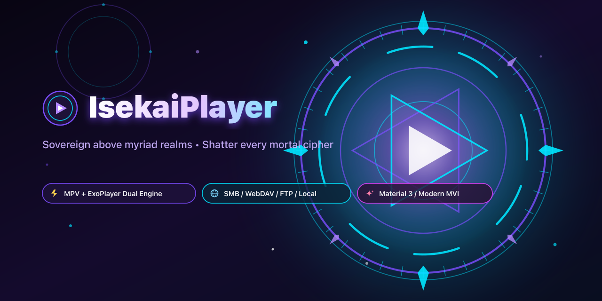
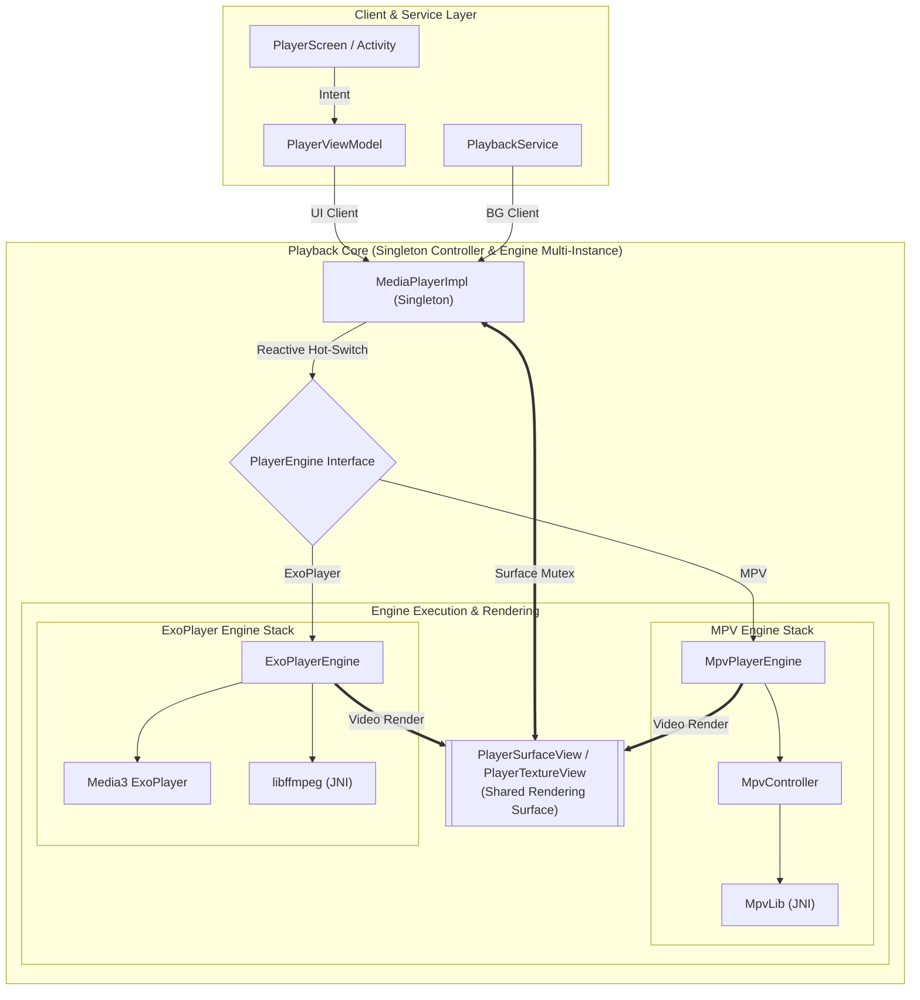

[中文说明 (Chinese Version)](README_zh.md)



# IsekaiPlayer

[](https://play.google.com/store/apps/details?id=com.fiepi.media.app)
[](https://github.com/onlymash/IsekaiPlayer/releases)

> ### *Apocalypse Zero: Genesis Stream*
> 
> *“Darker than the terminal twilight, sharper than the primeval blade.  
> Sovereign above the architecture of myriad realms, shatter every mortal seal of cipher.  
> Witness now, within this uninterrupted miracle—the genesis of the pristine world reborn!”*  
> 
> ***“— Transcending Horizons: Genesis Stream, UNLEASH!”***

IsekaiPlayer is a powerful, modern media player for Android designed to bridge the gap between local storage and remote networks. Built from the ground up with Jetpack Compose, it provides a unified, responsive, and elegant interface for all your media browsing and playback needs.

## 🚀 Key Features

*   **Unified Source Management**: Seamlessly browse and manage media from Local Storage, SMB (Samba), FTP, and WebDAV servers in one place.
*   **Dual Engine Architecture**: Support for both **mpv** (feature-rich, advanced subtitle styling, software audio gain, and video filters) and **ExoPlayer (Media3)** (hardware decoding, power-efficient streaming) with **seamless runtime hot-switching**.
*   **Adaptive Controls**: UI controls automatically adjust (enable, disable, or hide) based on the features supported by the active playback engine.
*   **Smooth Performance**: Responsive file browsing and fluid navigation powered by Jetpack Compose.
*   **Rich Metadata**: View file size, video resolution, duration, and modification dates at a glance.
*   **Smart Thumbnails**: Instant thumbnail generation for local videos and secure frame extraction for remote sources.
*   **Remote & Local Subtitle Support**: Full scanning, automatic language detection, and smart video association for external subtitle files (`.srt`, `.ass`, `.ssa`, `.vtt`, `.sub`) across local storage and remote servers (SMB, FTP, WebDAV).
*   **Customizable Player Layout & Visual Effects**:
    *   **Modular Control Layout**: Freely configure action buttons across all four screen corners with an interactive preview and a rich set of quick actions (PiP, Screenshot, Speed, Subtitle/Audio Delay, etc.).
    *   **Glassmorphic UI Effects**: Customizable backdrop blur, transparency, and visual styling for a polished aesthetic.
*   **Modern Navigation**: Multi-stack breadcrumb navigation with persistent scroll position restoration for every directory.
*   **Customizable Views**: Flexible sorting options and field visibility, securely persisted.
*   **Advanced Gestures**: Intuitive controls for volume, brightness, seeking, and playback speed.
*   **Material 3 Design**: A clean, adaptive interface that follows the latest Android design standards.

## 🛠 Tech Stack

*   **Minimum Requirement**: Android 13 (API 33)
*   **UI**: Jetpack Compose (Material 3)
*   **Navigation**: Navigation3
*   **Dependency Injection**: Koin
*   **Playback Engines**:
    *   **mpv**: Custom JNI bindings with Vulkan/OpenGL support
    *   **ExoPlayer (Media3)**: Integrated with OkHttp streaming and caching
*   **Image Loading**: Coil 3
*   **Network Protocols**: WebDAV, SMB, FTP
*   **Persistence**: DataStore & Room
*   **Language**: Kotlin

## 📂 Project Structure

The project is organized into multiple Gradle modules to enforce a clean separation of concerns and improve build performance:

*   **`:app`**: The UI and orchestration layer. Contains Compose screens, ViewModels, settings sub-pages, and main dependency injection configurations.
*   **`:domain`**: A **pure Kotlin JVM** module containing core business logic, entities, repository interfaces, use cases, and playback state abstractions. Zero dependencies on the Android framework.
*   **`:data`**: The persistence and networking layer. Implements repository interfaces, manages local database caching, and handles type-safe preference storage.
*   **`:player`**: The playback adapter and rendering layer. Bridges domain abstractions to concrete playback engines, manages player lifecycle, and provides universal rendering surface views.
*   **`:libmpv`**: Low-level C/C++ JNI bindings and native controller integration for the **mpv** media player engine.
*   **`:libffmpeg`**: Low-level C/C++ JNI bindings and FFmpeg software audio decoder integration for ExoPlayer (Media3).

## 🎬 Playback Architecture & Principles

IsekaiPlayer features a robust multi-engine video playback architecture built on unified player abstractions, designed for concurrency, high stability, and seamless runtime switching.

### 1. Layered Architecture



### 2. Core Design Principles

#### A. Multi-Engine & Reactive Hot-Switching
*   **Singleton Controller**: `MediaPlayerImpl` acts as a global singleton controller, coordinating client sessions, surface management, and engine switches.
*   **Engine Multi-Instance Isolation**: Releasing native engine handles (such as `MpvController` / `mpv_handle`) is time-consuming and executes asynchronously in the background. To achieve instant, glitch-free hot-switching between mpv and ExoPlayer without waiting for the slow cleanup of the previous engine, the native layer supports true multi-instance isolation. This eliminates resource contention when a new engine instance is created while the old instance is still releasing.
*   **Capabilities Adaptation**: Engine capabilities are exposed reactively, allowing UI controls to dynamically enable, disable, or hide engine-dependent features (such as OSD stats or frame-step backward).

#### B. Surface Ownership Mutex & Unified Views
*   **Context**: The Android `Surface` is a critical hardware resource. During engine handovers or activity transitions, multiple instances might compete for its control.
*   **Solution**: A dedicated surface mutex serializes surface attachment and detachment operations. Universal surface views serve as shared rendering targets across engines.

#### C. Type-Aware Reference Counting
*   **Client Categories**:
    *   **UI Clients**: Active user interface sessions responsible for video rendering.
    *   **Background Clients**: Media service sessions responsible for persistent background audio.
*   **Logic**: When all UI clients detach, the surface is released and video rendering is paused. The underlying engine instance is destroyed only when all UI and background client counts reach zero.

#### D. Native Safety & Thread Concurrency
*   **Challenge**: Releasing native engine handles or resetting media players while actively rendering can trigger thread contention or system crashes.
*   **Safety**: All engine state modifications and destruction sequences follow strict thread serialization and synchronous cleanup steps to guarantee safety across activity transitions and engine switches.

## 🛠 Building Native Libraries

For detailed options and usage of the build scripts, see [scripts/README.md](scripts/README.md) ([中文指南](scripts/README_zh.md)).

1.  **Download & Synchronize External Source Code**:
    Execute the script to fetch or sync the source code for mpv and its dependencies (ffmpeg, etc.):
    ```bash
    ./scripts/sync-sources.sh
    ```

2.  **Compile Native Libraries**:
    Run the build script to compile the libraries for the supported ABIs:
    ```bash
    ./scripts/build-native.sh
    ```

## 🚧 Project Status

*   [x] Unified Media Browser (Local, SMB, FTP, WebDAV)
*   [x] Dual Playback Engine Support (mpv & ExoPlayer/Media3)
*   [x] Reactive Engine Hot-Switching & Capabilities Adaptation
*   [x] Basic Playback Controls & Gestures
*   [x] Playlist Management
*   [x] Advanced Subtitle/Audio Track Selection
*   [x] Remote Subtitle Auto-Detection & Association (SMB, FTP, WebDAV)
*   [x] Customizable Player Layout & Glassmorphic UI Effects

## 🙏 Acknowledgments

*   **[mpv-android](https://github.com/mpv-android/mpv-android)**: Thanks for providing the foundational Android build scripts and configuration parameters for `libmpv`.
*   **[mpvRex-libmpv](https://github.com/sfsakhawat999/mpvRex-libmpv)**: Special thanks for the Vulkan integration references, and high-performance sharpening shaders.
*   **[AndroidX Media3](https://developer.android.com/media/media3)**: Thanks to Google's Media3 team for providing ExoPlayer and Compose layout sizing patterns.

## 📄 License

IsekaiPlayer is licensed under the [GNU General Public License v3.0 (GPLv3)](LICENSE).
