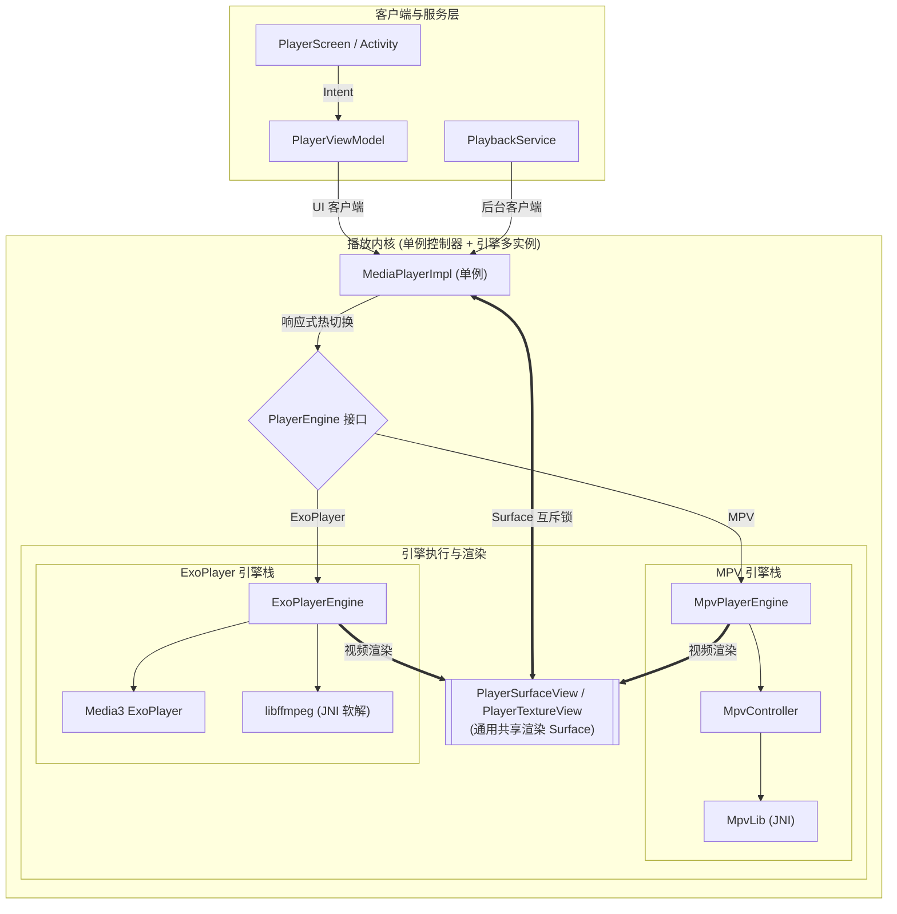

[English Version](README.md)

# IsekaiPlayer

[](https://play.google.com/store/apps/details?id=com.fiepi.media.app)

> ### 滅世真理・零式原初解構
> 
> *「比夜更黑的終末，比光更銳的權柄。  
> 凌駕於諸界架構之上，粉碎萬千編碼之重障。  
> 見證吧，在此無間斷的神跡之中，原初之世界重塑誕生——」*  
> 
> **「——超越境界・『零式原初解構』！」**

**IsekaiPlayer** 是一款专为 Android 打造的功能强大且现代的媒体播放器，采用 Jetpack Compose 从头构建。它完美融合了本地存储与多种远程网络协议，为您提供统一、灵敏且优雅的媒体浏览与播放体验。

## 🚀 核心功能

*   **统一源管理**：在一个应用内无缝浏览和管理本地存储、SMB (Samba)、FTP 和 WebDAV 服务器。
*   **双播放引擎架构**：同时支持 **mpv 引擎**（功能全能强劲，支持高级特效字幕、音轨软增益及滤镜）与 **ExoPlayer (Media3) 引擎**（原生硬解省电，网络传输流畅），支持**播放中无缝切换引擎**。
*   **引擎能力自适应**：界面控件会根据当前激活引擎所支持的功能自动智能联动（如置灰禁用或隐藏不支持的操作）。
*   **丝滑性能**：基于 Jetpack Compose 构建，确保文件列表滚动与导航轻盈流畅。
*   **丰富元数据**：文件大小、视频分辨率、时长、修改日期一目了然。
*   **智能缩略图**：本地视频极速预览，远程视频安全提取。
*   **远程与本地外挂字幕识别**：全面支持各类常见外挂字幕格式（`.srt`, `.ass`, `.ssa`, `.vtt`, `.sub`）。无论本地还是远程服务器（SMB, FTP, WebDAV），都能自动扫描同目录字幕并与同名视频智能关联。
*   **自定义播放布局与视觉特效**：
    *   **四角模块化布局**：支持针对播放界面四个角落自由配置动作按钮，提供实时可视化布局预览与丰富的快捷动作库（画中画、截图、倍速、字幕/音频延迟等）。
    *   **毛玻璃视觉特效**：提供背景模糊与透明度微调等视觉效果，兼顾精致感与流畅渲染。
*   **现代化导航**：支持多级面包屑导航，并能自动恢复每个目录的滚动位置。
*   **个性化视图**：灵活的排序选项和显示偏好，配置通过强类型存储持久化。
*   **高级手势**：直观的音量、亮度、进度跳转及倍速控制手势。
*   **Material 3 设计**：遵循最新 Android 设计规范，界面简洁优雅。

## 🛠 技术栈

*   **UI 框架**：Jetpack Compose (Material 3)
*   **导航**：Navigation3
*   **依赖注入**：Koin
*   **播放引擎**：
    *   **mpv**：支持 Vulkan/OpenGL 渲染的定制 JNI 引擎
    *   **ExoPlayer (Media3)**：集成高性能网络传输与缓存支持
*   **图像加载**：Coil 3
*   **网络协议**：WebDAV, SMB, FTP
*   **持久化**：DataStore & Room
*   **编程语言**：Kotlin

## 📂 项目结构

项目采用了多 Gradle 模块化设计，以强制执行关注点分离并提升构建性能：

*   **`:app`**：UI 与编排层。包含 Compose 界面、界面状态与交互逻辑、设置子页面以及全局依赖注入的聚合配置。
*   **`:domain`**：**纯 Kotlin JVM** 模块。包含核心业务逻辑、领域实体、仓库接口、用例及播放状态与引擎能力模型。完全脱离 Android 框架依赖。
*   **`:data`**：持久化与网络层。实现仓库接口，管理本地数据库缓存，并处理强类型的偏好设置持久化。
*   **`:player`**：媒体播放适配与渲染视图层。负责将领域层的播放抽象桥接到具体的播放引擎，管理播放器生命周期，并提供通用的渲染视图。
*   **`:libmpv`**：底层 C/C++ JNI 绑定以及针对 **mpv** 播放引擎的底层控制逻辑。
*   **`:libffmpeg`**：底层 C/C++ JNI 绑定以及为 ExoPlayer (Media3) 提供 FFmpeg 软解码支持。

## 🎬 播放架构与原理

本项目构建了一套支持多引擎（mpv + ExoPlayer）、多实例并发、具有高度稳定性且防竞态的 Android 视频播放架构。

### 1. 逻辑分层图



### 2. 核心设计原则

#### A. 多引擎架构与响应式热切换 (Multi-Engine & Hot-Switching)
*   **单例控制器**：`MediaPlayerImpl` 作为全局单例播放控制器，统一调度客户端引用计数、Surface 状态及引擎切换。
*   **引擎多实例隔离**：原生引擎（如 `MpvController` / `mpv_handle`）的初始化与销毁非常耗时且在后台异步执行。为了在切换引擎时无需等待旧引擎销毁即可实现无缝热切换，底层的原生引擎层支持完整的**多实例隔离**。这彻底避免了旧实例销毁过程与新实例创建过程重叠时的资源竞争与卡顿。
*   **能力自适应**：UI 控件响应当前引擎暴露的能力状态，自动针对当前引擎（如 OSD 统计面板、逐帧倒退等）进行置灰禁用或隐藏。

#### B. Surface 归属权互斥与通用视图 (Surface Ownership Mutex)
*   **背景**：Android `Surface` 是宝贵的硬件资源。在引擎切换或界面过渡时，新旧引擎可能会争夺同一个 Surface 的控制权。
*   **方案**：在播放内核中引入专门的互斥锁机制，对渲染 Surface 的绑定与解绑操作进行顺序化排队，防止资源争用。同时采用通用的 Surface 渲染视图作为统一的渲染承载目标。

#### C. 引用计数生命周期管理
*   **客户端分类**：
    *   **前台 UI 客户端**：负责视频渲染的界面会话。
    *   **后台服务客户端**：负责音频持续播放的媒体服务会话。
*   **行为逻辑**：当所有前台 UI 客户端退出时，立即解绑 Surface 并暂停视频渲染；只有当所有前台与后台客户端计数同时归零时，才会真正销毁底层引擎实例。

#### D. 线程安全与安全销毁 (Native Safety)
*   **挑战**：在处于渲染状态时直接销毁原生引擎句柄或重置播放器，容易引发线程竞争与崩溃。
*   **防崩溃**：播放引擎严格保障 API 调用的线程同步，原生引擎销毁时执行严格的同步排空与解绑时序，确保在解绑渲染 Surface 或销毁引擎句柄时不会触发系统崩溃或内存泄漏。

## 🛠 编译原生库

详细的构建脚本选项与使用指南，请参阅 [scripts/README_zh.md](scripts/README_zh.md) ([English Guide](scripts/README.md))。

1.  **下载与同步外部源码**：
    执行脚本以获取或更新 mpv 及其依赖（ffmpeg 等）的源代码：
    ```bash
    ./scripts/sync-sources.sh
    ```

2.  **编译原生库**：
    运行构建脚本为支持的 ABI 编译库文件：
    ```bash
    ./scripts/build-native.sh
    ```

## 🚧 项目进度

*   [x] 统一媒体浏览器 (本地, SMB, FTP, WebDAV)
*   [x] 双播放引擎架构 (集成 mpv 与 ExoPlayer/Media3)
*   [x] 响应式引擎热切换与能力自适应
*   [x] 基础播放控制与手势
*   [x] 播放列表管理
*   [x] 高级字幕/音轨选择
*   [x] 远程数据源外挂字幕自动识别与关联 (SMB, FTP, WebDAV)
*   [x] 自定义播放布局与液态玻璃视觉特效

## 🙏 鸣谢

*   **[mpv-android](https://github.com/mpv-android/mpv-android)**：特别感谢该项目提供的基础 `libmpv` Android 构建脚本与配置参数参考。
*   **[mpvRex-libmpv](https://github.com/sfsakhawat999/mpvRex-libmpv)**：特别感谢该项目提供的 Vulkan 集成参考以及高性能锐化着色器补丁。
*   **[AndroidX Media3](https://developer.android.com/media/media3)**：特别感谢 Google Media3 团队提供的 ExoPlayer 播放库与 Compose 视图模式参考。

## 📄 开源许可证

IsekaiPlayer 采用 [GNU General Public License v3.0 (GPLv3)](LICENSE) 开源许可证。
